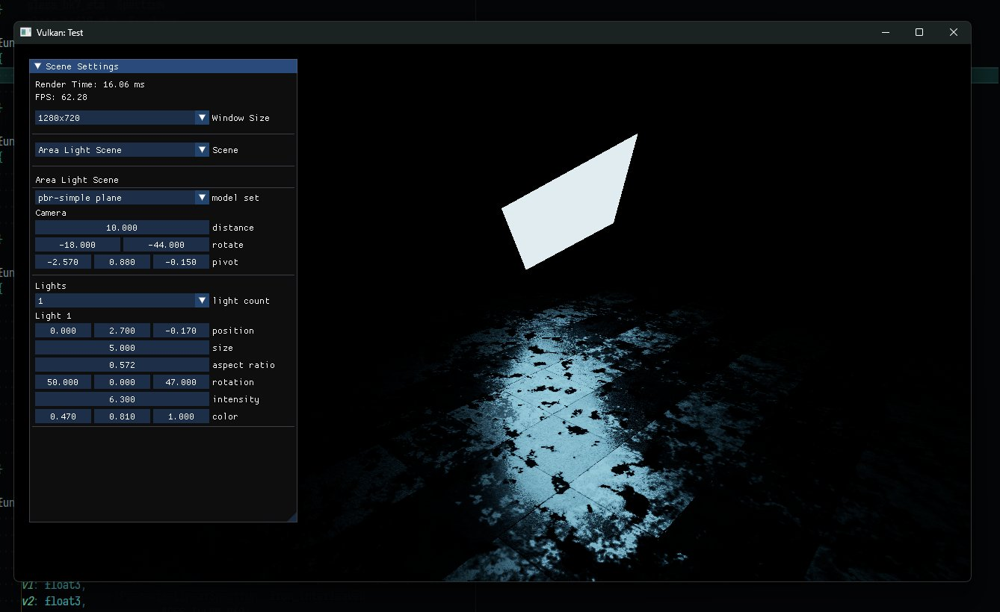
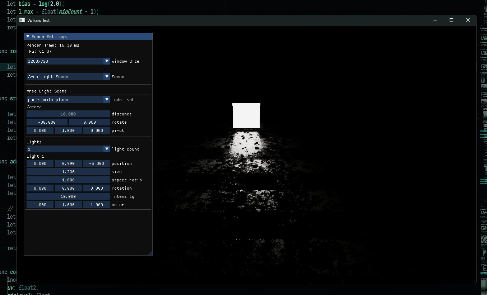
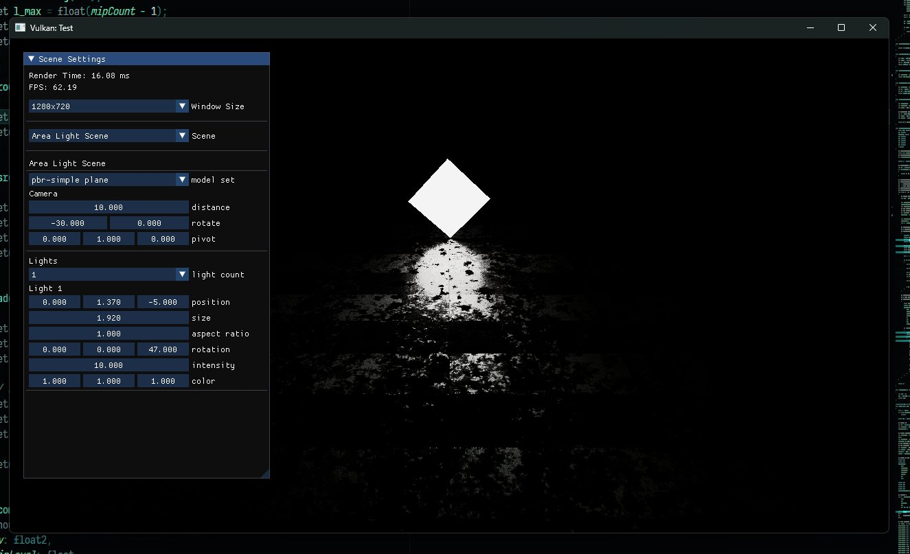
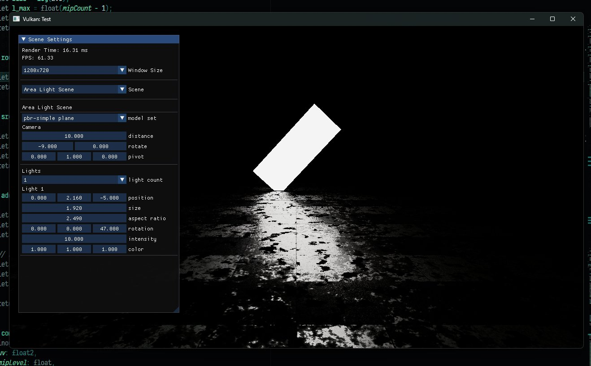
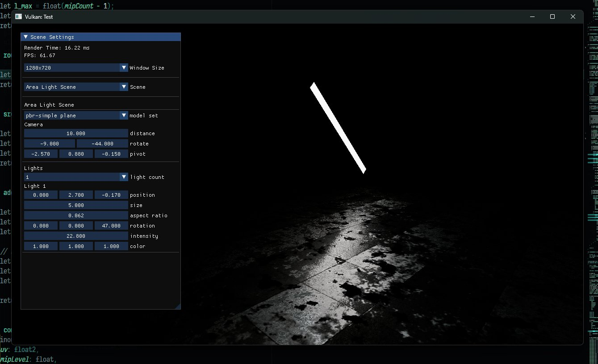

# RealtimeNeuralAreaLightInternal

```
git submodule update --init --recursive
cd ash
patch -p1 < ../ash.patch
cd ..
cargo run --release
```

リアルタイム面光源にCoopVecを使うのを作ろうと思って頓挫したもの。

既存のリアルタイム面光源手法のLinearly Transformed Cosine (LTC)は内部で二次元のテーブルを持っている関係上、異方性反射とかパラメタの多い複雑なマテリアルは扱えず、またLambertから線形変換で歪ませたローブのみでより複雑なローブは扱えない。
それらをNeural Shaderで解決しようとしたが、ちょっと学習がうまく行っていない。

またタイミングを見て再開するかもしれない。











https://x.com/MatchaChoco010/status/1930599606209114140

https://x.com/MatchaChoco010/status/1930599611301044677

https://x.com/MatchaChoco010/status/1931328800169906491

https://x.com/MatchaChoco010/status/1931328805190176880
